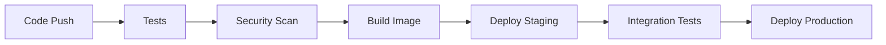

# Document Redlining API - Production Architecture & Operations

## 🏗️ Architecture & Infrastructure

### Compute Layer
- **FastAPI Application**: Containerized with Docker, deployed on Kubernetes pods
- **Auto-scaling**: Horizontal Pod Autoscaler (HPA) based on CPU/memory usage
- **Resource Limits**: 2 CPU cores, 4GB RAM per pod, 3-10 replicas

### Storage Layer
- **Primary**: Google Cloud Storage (GCS) for document persistence
- **Caching**: Redis Cluster for session data and temporary locks
- **Search Index**: Elasticsearch cluster for full-text search capabilities
- **Backup**: GCS versioning + cross-region replication

### Network & Load Balancing
- **Ingress**: Cloud Load Balancer with SSL termination
- **CDN**: Cloud CDN for static assets (frontend)
- **API Gateway**: Rate limiting, request validation, CORS management

## 🚀 CI/CD & Deployment

### Pipeline Stages

### Deployment Strategy
- **Blue-Green**: Zero-downtime deployments
- **Canary**: 5% traffic to new version/dummy versions, monitor metrics
- **Rollback**: Automatic rollback on health check failures
- **Infrastructure as Code**: Terraform for GCP resources

## 🔒 Security & Compliance

### Authentication & Authorization
- **OAuth2/OpenID Connect**: Google Workspace SSO integration
- **JWT Tokens**: Short-lived (15min) with refresh tokens
- **RBAC**: Document-level permissions (owner, editor, viewer)
- **API Keys**: For service-to-service communication

### Data Protection
- **Encryption**: AES-256 at rest, TLS 1.3 in transit
- **Key Management**: Google Cloud KMS for encryption keys
- **Audit Logging**: All document operations logged to BigQuery
- **Data Retention**: Configurable retention policies per document type

### Compliance
- **GDPR**: Right to be forgotten, data portability
- **SOC2 Type II**: Annual compliance audits
- **Data Residency**: EU/US data localization options
- **Access Controls**: IP whitelisting, VPN requirements

## 📈 Scalability & Resilience

### Auto-scaling Strategy
- **CPU-based**: Scale up at 70% CPU, down at 30%
- **Memory-based**: Scale up at 80% memory usage
- **Queue-based**: Scale based on pending redline operations
- **Geographic**: Multi-region deployment for global users

### Failover & High Availability
- **Multi-AZ**: Kubernetes pods spread across availability zones
- **Database**: GCS with 99.99% SLA, cross-region replication
- **Circuit Breakers**: Hystrix for external service calls
- **Retry Logic**: Exponential backoff for transient failures

### Batching & Performance
- **Batch Operations**: Up to 100 documents per redline request
- **Async Processing**: Celery workers for large document operations
- **Caching**: Redis for frequently accessed documents
- **Connection Pooling**: Database connection optimization

## 📊 Monitoring & Observability

### Metrics Collection
- **Application Metrics**: Prometheus + Grafana
  - Request latency (p50, p95, p99)
  - Error rates by endpoint
  - Document operation throughput
- **Infrastructure Metrics**: Cloud Monitoring
  - CPU, memory, disk usage
  - Network I/O and bandwidth
  - GCS operation metrics

### Logging Strategy
- **Structured Logging**: JSON format with correlation IDs
- **Log Aggregation**: Cloud Logging + BigQuery for analysis
- **Log Levels**: DEBUG, INFO, WARN, ERROR with appropriate sampling
- **Audit Trail**: Immutable logs for compliance requirements

### Distributed Tracing
- **Jaeger Integration**: End-to-end request tracing
- **Span Correlation**: Track operations across services
- **Performance Analysis**: Identify bottlenecks in redline operations

### Alerting
- **Critical Alerts**: Service down, high error rates
- **Warning Alerts**: High latency, resource usage >80%
- **Business Alerts**: Failed redline operations, document access issues
- **Escalation**: PagerDuty integration with on-call rotation

## 💰 Operations & Cost Management

### Cost Optimization
- **Resource Right-sizing**: Monthly analysis of CPU/memory usage
- **Storage Tiering**: Hot (frequent access) vs Cold (archival) storage
- **Reserved Instances**: 1-3 year commitments for predictable workloads
- **Spot Instances**: For non-critical batch processing

### Multi-region Strategy
- **Primary Region**: us-central1 (lowest latency for US users)
- **Secondary Region**: europe-west1 (GDPR compliance)
- **Disaster Recovery**: us-east1 as backup region
- **Data Sync**: Cross-region replication with eventual consistency

### Operational Excellence
- **SLA Targets**: 99.9% uptime, <200ms p95 latency
- **Incident Response**: 15-minute MTTR for critical issues
- **Capacity Planning**: Quarterly reviews with business growth projections
- **Cost Monitoring**: Real-time cost alerts, monthly budget reviews

## 🎯 Priority Trade-offs

| Priority | High | Medium | Low |
|----------|------|--------|-----|
| **Security** | Encryption, Auth | Audit logs | Advanced threat detection |
| **Performance** | P95 latency | Auto-scaling | Edge caching |
| **Cost** | Resource optimization | Multi-region | Advanced monitoring |
| **Compliance** | GDPR basics | SOC2 | Advanced compliance |

### Key Decisions
1. **GCS over Database**: Better for large documents, simpler scaling
2. **Kubernetes over Serverless**: More control, predictable costs
3. **Redis over In-memory**: Persistence, multi-pod sharing
4. **OAuth2 over API Keys**: Better security, user management

This architecture prioritizes **security**, **performance**, and **operational simplicity** while maintaining cost-effectiveness for a document redlining service. 